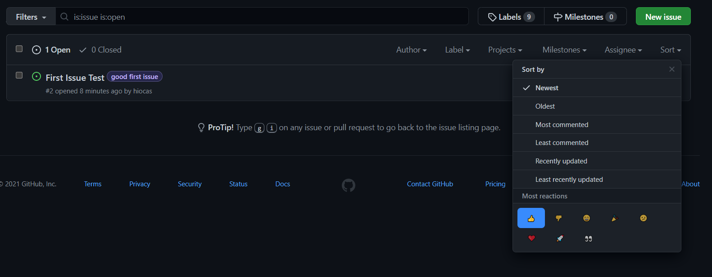
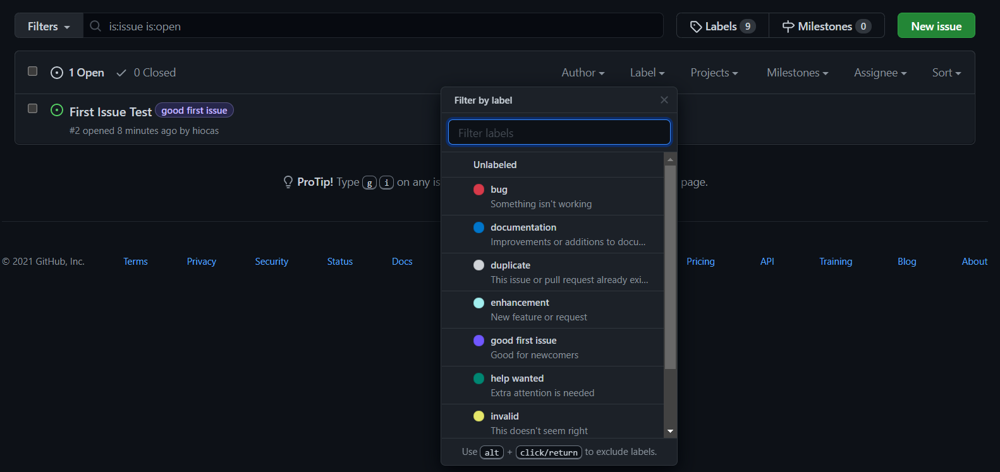
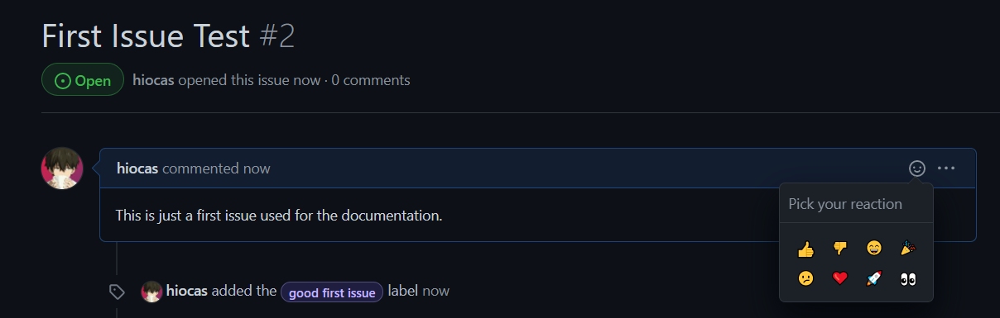
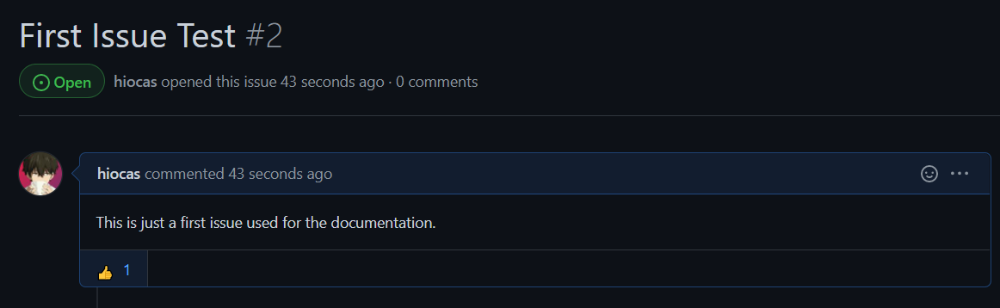

# Contributions
Whether you can code or not, there's probably something you can help us with :)
## Code
If you can code, new features and code patching and improvements are always welcome!
You can make a new pull request [here.](https://github.com/hiocas/EavesDrop/pulls)
If you're new to Dart and Flutter, don't fret. So was I before I started this project. While I'm definitely not that great at it yet you can always just try to make your changes and see how it goes. And of course you can always dm me on reddit for help!

## Other Stuff
If you're not a programmer, there are a lot of other things you can help us with!

Generally, most none-code related changes can be started by creating a new Feature Request or Feature Improvement on the [issues page](https://github.com/hiocas/EavesDrop/issues) of this repo. If you already have one of these in mind, here's a quick tutorial to get started:

  
I have a Feature Request or a Feature Improvement

  
  First of all, browse through the [issues](https://github.com/hiocas/EavesDrop/issues?q=is%3Aissue) in this repo and make sure your feature isn't already suggested (make sure to look at closed issues as well as open ones). If your feature is already there, make sure to vote 👍 for it!
  
  If not, click on New Issue and choose the relevant template.
  
  Let's say that you don't like the name of the app and you have another one in mind. This means changing an existing thing so it's a Feature Improvement.
  
  After clicking the template just follow the instructions there. Please note that for some Feature Improvements (like the one in the example above) we may need some votes to see that this is actually a wanted "improvement" and not just a personal thing.

Regardless, here are some general things you can help with!

### Things You Can Help With
**Please note that for most feature improvements you'll suggest you'll need to gain some votes before we can actually implement them.**

This will help us decide if it's actually a wanted "improvement", so we'll only implement changes the community actually wants.
For feature requests it's a lot more loose.

  
Design

  
UI/UX and Graphic Design. You can always take a look at our app and see if there's something in that area that could use some work. If you found one you can create a new Feature Improvement and describe everything there.

Tag Icons

If you've noticed, some tags in the app display an image or some emojis instead of the default tag icons. You can add to these yourself or change existing ones! These do require some bit of coding but for most cases it can be very simple so that none-programmers can do it too.

  I'll be working on a guide to do it manually but for now, you can just create a new Feature Improvement [issue](https://github.com/hiocas/EavesDrop/issues) and provide the word or word combination for the tag and the icon for it.

**Make sure to put [TAG] in your issue's title.**
  
**If you have multiple ideas please put them all in the same issue so we won't get flooded.**
  
  **If you're using an image make sure it's from a reputable source and that there are no copyright issues with it.**
  
**These are the currently supported icons you can choose:**
- A single Emoji character
- Two Emoji characters
- A single image

>Example:
>Word - Fdom, Emoji - 😈 (this one sucks tho so make a good one :) ). 

If you think you can do these manually, you can always head to the code base. The specific code for this is in [lib/screens/submission_page/local_widgets/gwa_tag.dart](lib/screens/submission_page/local_widgets/gwa_tag.dart).

Placeholder Images

  If a post in GoneWildAudio doesn't have an image preview, we use one of our own.
  There are currently 2 packs available for the user (from which he can choose from the setting): Gradients and Abstract.
  
  You can modify the existing packs (add or change ones in it) if you think they don't look good or fit in the app, or you can create completely new packs.
  
  **When choosing images to add, please make sure that there are no copyright problems with them and that the source is reputable.**
  
  To start, go to the [issues page](https://github.com/hiocas/EavesDrop/issues) and create a new Feature Improvement if you're changing existing content or a Feature Request if you're making a new pack.
  
  For modifying content include the pictures you want to add or remove with an explanation why.
  
  For new packs include the pack name and the pictures associated with it. Try to include upwards of 10 pictures but don't go too crazy.
  
  **Make sure to include [PLACEHOLDER] in your issue's title.**
  
  You can also always just create a new pull request and add these manually (it's in [lib/utils/gwa_functions.dart](lib/utils/gwa_functions.dart)) This is a bit more complicated then the tag icons since this also has a setting that needs to be saved so expect some back and fourth between us (until I create a guide).
  
 

 

## Voting
You can vote on existing feature request and improvements that you want to see implemented. This way we can know what features and improvements are the most important to the community and which ones aren't.

You can do so by heading to the [issues](https://github.com/hiocas/EavesDrop/issues) or [pull requests](https://github.com/hiocas/EavesDrop/pulls) page on the GitHub repo for this app and finding feature requests and improvements you like.

*(Issues are basically like forum posts while pull requests contain code. It shouldn't really matter, just know that there could be new features and improvements on both).*

To sort issues and pull requests by their votes, click on Sort and choose either 👍 or 👎.

Here's the link for [the issues with the most 👍.](https://github.com/hiocas/EavesDrop/issues?q=is%3Aissue+is%3Aopen+sort%3Areactions-%2B1-desc)

You can also sort issues and pull requests by their label. For new feature requests and feature improvements the relevant label is [enhancement.](https://github.com/hiocas/EavesDrop/issues?q=is%3Aissue+is%3Aopen+sort%3Areactions-%2B1-desc+label%3Aenhancement)

You can filter issues by labels by clicking on the Label button and choosing the label you want to sort by.

Once you do, click on the one you want to vote on. Then, click on the little smiley face at the top right of the issue and react with a 👍 or a 👎.

 
